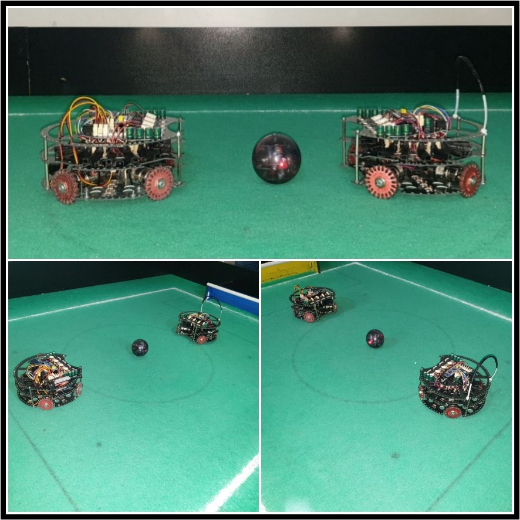

# ⚽ Nemesis – Junior Soccer Lightweight Robot

This project is a soccer-playing robot developed by the Nemesis team from Allame Helli 5 High School for the IranOpen RoboCup competition. The robot is designed to detect, chase, and control an infrared-emitting ball, navigate the field, and play both offensive and defensive roles.

  

## 🛠 How it works
- Ball detection using IR sensors (IRM8601S) placed around the robot.  
- Positioning & orientation with a GY-25 gyroscope module.
- Line detection with multiple LDR sensors to avoid going out of bounds.  
- Offensive & defensive algorithms to coordinate striker and goalkeeper roles.  

## 🔧 Hardware Components
- **STM32F103C8T6**: 32-bit ARM microcontroller for main control 
- **IRM8601S IR Sensors**: ball detection in 16 directions 
- **GY-25 Gyroscope**: orientation tracking 
- **SHARP GP2D120 Sensors**: distance measurement for walls and positioning 
- **L6203 Motor Drivers**: high-current motor control  
- **DC Gear Motors (555 RPM)**: omnidirectional movement with mecanum/omni wheels
- **LDR Sensors**: line detection for field boundaries 
- **Custom PCBs**: lightweight structure and reduced wiring

## 📡 Communication
- Sensor data is read via **ADC** and **multiplexers** (4067 ICs).
- Motor control is handled by **PWM signals** from STM32.
- Algorithms adjust speed and direction based on ball position, field boundaries, and opponent location. 

## 🤖 Roles
- Striker: Actively chases the ball and aims for the opponent’s goal.
- Goalkeeper: Maintains position near own goal, intercepts incoming shots.

## 🚀 Innovations
- Increased number of **LDR sensors** for higher boundary detection accuracy.
- Dual multiplexer system to handle large numbers of sensors with limited pins.
- Modular design allowing quick replacement of gyroscope or compass modules.
- LCD display for real-time debugging and sensor data visualization.

## Summary
The Nemesis robot demonstrates how **sensor fusion, mechanical design, and embedded programming** can be combined to create a competitive RoboCup soccer robot. Its design focuses on **speed, precision, and adaptability** in dynamic match conditions.  

---

✨ *Thanks for checking out this project!*  
